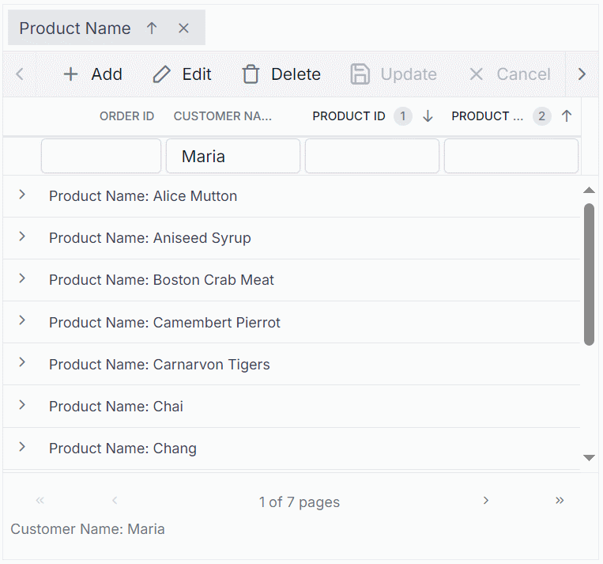

# vue-data-grid-integration-with-custom-binding
The repository contains a professional demonstration of a custom binding with the Grid control. This application showcases essential functionalities such as filtering, searching, grouping, editing, and paging, all implemented using custom binding.
* Execute the following command to install the necessary dependencies:
`npm install`
* Update the port number in the `serve.js` file to load your data. Also, update the same port number in the `src/orderService.ts` file.
* Run the project using following command:
`npm run start`
Finally, the Syncfusion Vue Grid control will be rendered with custom binding.
